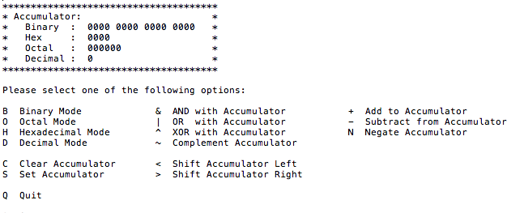

# accumulator
Displays values in different base representations (binary, hexadecimal, octal, and decimal) based on the current value of the program’s accumulator. Also performs logical and bitwise operations. 

